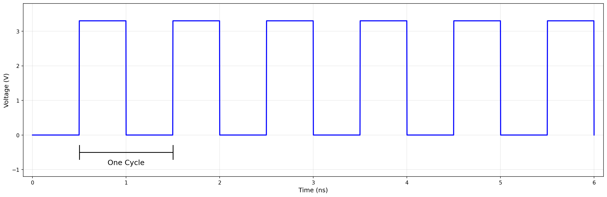
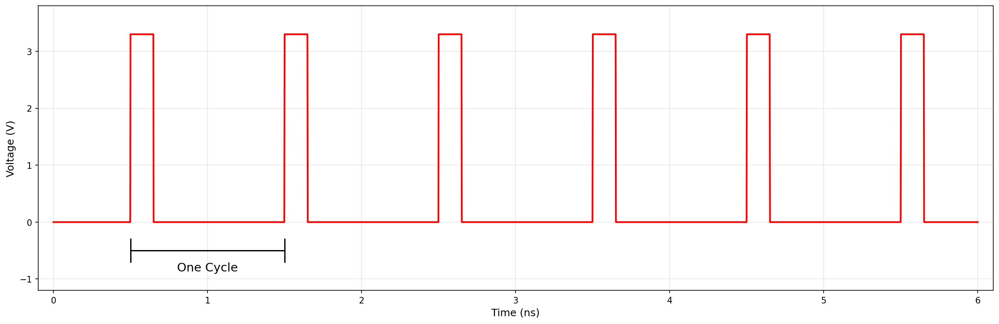

# Controlling Pins with MicroPython

## Libraries and Modules
There is a lot of code already written in MicroPython that we can use in our own
programs. This code is distributed as a {term}`library` that contains functions
and variables that we can use to perform common tasks. Much like a library we
might go to for books, we have to explicitly go to the library and "check out"
the code before we are able to use it in our programs.

MicroPython comes with a library of code built-in as standard, and thus we call
this the *standard library*. However, other developers can provide additional
libraries. We often call these *third-party libraries*.

### Math Module

One collection of code in the standard library is called the `math`
{term}`module`. A module is a collection of related functions and variables that
are grouped together in a file. Modules can be hierarchical, that is we can have
modules defined inside other modules. Much like on your computer where you can
have folders inside folders to organize your documents.

The math module contains many math related functions and some predefined
constants. For example `math.sin(x)` computes the $\sin$ of the argument `x`
(where `x` is in radians).

To use the functions and definitions in the math module your program first needs
to tell MicroPython that we need it using an *import statement*.

```{code-block} python
:linenos:
import math
```

One way to compute the square root of a number would be just to raise to the 1/2 power. 

```{code-block} python
:linenos:
print(2**.5)
```

Another way would be to use the math module's square root function.

```{code-block} python
:linenos:
print(math.sqrt(2))
```

:::{tip}
`import` is a MicroPython *keyword*. A keyword is a word reserved for use by MicroPython. 
As such you should never use a keyword as a variable name (in fact that is an error). 
:::

A constant defined in the math module is `math.pi`

```{code-block} python
:linenos:
print(math.pi)
```

```{code-block} console
3.141592653589793
```

:::{note} 
To reference functions and definitions in a module use *dot notation*. For example, `math.pi` or `math.sqrt(x)`.
:::

### Time Module
Another useful module is the `time` module. This module contains functions for
working with time-related tasks. One function in this module is `sleep(seconds)`
which pauses the execution of the program for the specified number of seconds.

```{code-block} python
:linenos:
import time

print("Hello")
time.sleep(2)  # Pause for 2 seconds
print("World")
```

This program will print "Hello", wait for 2 seconds, and then print "World".

## Controlling a Pin on the Microcontroller

The physical pins on a microcontroller allow us to interface with external
components such as input sensors or output displays and actuators. We will start
by using a pin to output a digital signal (i.e., turn it on or off).

When a pin is turned *on*, it outputs a voltage (typically 3.3V or 5V depending
on the microcontroller). This means that electrical current can flow from the
pin, through other components, and back to ground.

When a pin is turned *off*, it is connected to ground (0V). This means that no
current can flow from the pin.

### Turning an LED On and Off
Our first example of an output pin will be to turn a light-emitting diode (LED)
on and off. An LED is a special component that emits light when electrical
current flows through it. LEDs are polarized components, meaning they have a
positive (anode) and negative (cathode) lead. A {term}`diode` only allows
current to flow from the anode to the cathode. If we connected a higher voltage
to the cathode, no current would flow and the LED would not light up.

LEDs can only handle a limited amount of electrical current before they are
damaged and no longer work. Our microcontroller pins can supply more current
than an LED can handle, so we need to use an additional device called a
{term}`resistor` to absorb the addition current. In this sense, it *limits* the
current flowing through the LED to a safe level, so we refer to this use of a
resistor as a *current-limiting resistor*.

:::{hint}
The long leg of the LED is the anode (positive) and should be connected to the
microcontroller pin. The short leg is the cathode (negative) and should be
connected to ground (0V).
:::

How do we pick the correct value for the current-limiting resistor? We need to
know a few bits of information:
- The *forward voltage* or voltage needed to turn on the LED
- The maximum current the LED can handle safely
- The voltage output by the microcontroller pin when it is turned on

With this information, we can use Ohm's Law to calculate the appropriate resistance value for the current-limiting resistor.

$$ V = I \cdot R $$

Where:
- $V$ is the voltage across the resistor
- $I$ is the current through the resistor
- $R$ is the resistance

We can rearrange this formula to solve for $R$:

$$ R = \frac{V}{I} $$

To find the voltage across the resistor, we subtract the forward voltage of the
LED from the voltage output by the microcontroller pin. We then divide this by
the current we want to allow through the LED to find the resistance.

:::{exercise}
:label: ex-led-resistor

Given an LED with a forward voltage of 2.0V and a maximum current of 6mA
(0.006A), and a microcontroller pin that outputs 3.3V when turned on, calculate
the value of the current-limiting resistor needed to safely operate the LED.

:::
:::{solution} ex-led-resistor
First, we need to find the voltage across the resistor. This is the difference
between the voltage output by the microcontroller pin and the forward voltage of
the LED: $$ V_{resistor} = V_{pin} - V_{LED} = 3.3V - 2.0V = 1.3V $$

Next, we can use Ohm's Law to calculate the resistance:
$$ R = \frac{V_{resistor}}{I} = \frac{1.3V}{0.006A} = 216.67\Omega $$

We would typically round this up to the nearest standard resistor value, which is
220Ω.
:::

:::{exercise}
:label: ex-led-resistor-2
An LED has a forward voltage of 1.8V and a maximum current of 10mA (0.01A). If
the microcontroller pin outputs 5V when turned on, what value of current-limiting
resistor is needed to safely operate the LED?
:::
:::{solution} ex-led-resistor-2
:class: dropdown
$ R = \frac{V_{resistor}}{I} = \frac{5V - 1.8V}{0.01A} = \frac{3.2V}{0.01A} = 320\Omega $
:::

(sec-wiring-up-led-circuit)=
### Wiring up the Circuit
We will make use of a *breadboard* to build our circuit. Breadboards are used to
prototype circuits without soldering. They have a series of holes that are
connected together in a specific pattern. The holes are used to insert wires and
components to build a circuit.

There are two main types of connected holes on a breadboard: *power rails* and
*terminal strips*. Power rails are used to distribute power to the circuit, while
terminal strips are used to connect components together. Power rails run the
entire length of the breadboard (all holes in a row are connected), while
terminal strips are connected in groups of five. There is a gap between the rows
of terminal strips to allow for DIPs to be inserted.

Items you will need:
- ESP32 board
- Red LED (note that the longer leg is the anode (+))
- 220Ω resistor
- Breadboard
- Jumper wires (x2)

Wire up the circuit as shown in @fig-led-circuit.

```{figure} ./img/fig-led-circuit.png
:label: fig-led-circuit
:alt: Circuit diagram showing an LED connected to a microcontroller pin through a current-limiting resistor
:align: center  

Circuit diagram showing an LED connected to a microcontroller pin through a current-limiting resistor. This image was created using [Fritzing](http://fritzing.org/).

```
Note that one wire is connected to GPIO pin 32 and the other is connect to ground (GND).

### Writing the MicroPython Code to Control the LED
MicroPython includes a special module called `machine` that provides functions
and operations for controlling hardware components of the microcontroller. 

One operation provided by the `machine` module is a function to access a specific pin:

```{code-block} python
:linenos:
import machine
import time

led = machine.Pin(32, machine.Pin.OUT)
```

The `Pin` function takes two arguments: the pin number (in this case 32) and the mode
(which can be either `machine.Pin.IN` for input or `machine.Pin.OUT` for output).
Since we want to control the LED, we set the mode to output.

Most of the variables we have encountered so far have held strings, integers, or
floats. The variable `led` above represents a *reference* to an Pin object. For
now, think of a reference as being a variable that refers to a complex object
such as a pin or display.

:::{note} 
An *object* in MicroPython is a value (not unlike an integer or a float) that 
contains functions for accessing the data in the object. Functions associated 
with objects are called *methods*.
:::

For example, a Pin object has a method `on()` that turns the pin on and a method
`off()` that turns the pin off. Methods are always called using a *dot notation*
of the object name followed by the methods. For example, `led.on()`.

We can use the `time` module's `sleep()` function to create a delay between
turning the LED on and off. Here is the rest of our program to blink the LED:

```{code-block} python
:linenos:
:lineno-start: 5
led.on()  # Turn the LED on
time.sleep(1)  # Wait for 1 second
led.off()  # Turn the LED off
```

:::{exercise}
:label: ex-blink-led-pause
Can you think of a way to keep the LED on until the user presses return on the keyboard?
:::
:::{solution} ex-blink-led-pause
:class: dropdown
You can use the `input()` built-in function to wait for user input before turning off the LED:

```{code-block} python
:linenos:
import machine

led = machine.Pin(32, machine.Pin.OUT)
led.on()  # Turn the LED on
input("Press Enter to turn off the LED...")  # Wait for user input
led.off()  # Turn the LED off
```
:::

## Programmatically Dimming an LED
What if we wanted to make the LED dimmer instead of just fully on or fully off?
One possibility would be to change the value of the current-limiting resistor to
a higher value. However, this would require physically changing the resistor in
the circuit each time we wanted to change the brightness of the LED. There are
also *variable* resistors (also called potentiometers) that can be adjusted, but
again this would require manual adjustment.

If we want to do this with software, we have to think about LED brightness
differently. The human eye is relatively slow to respond to changes in light.
Our brains only process visual information about 24-60 times per second. This is
called a {term}`frame rate`. If something happens faster than this, our brains
will blur it together. Thus, if we turn the LED on and off quickly enough, our
brains will perceive it as being dimmer than if the LED were on all the time.

The less time the LED is on, the dimmer it will appear. We can represent these
on vs. off times by making a graph of voltage over time. The LED will be on when
the voltage is high, and off when the voltage is low. Because a microcontroller
pin is either on or off, we will have rapid transitions between high and low
voltage, thus producing a {term}`square wave`.

### Square Waves, Frequency, Period, and Duty Cycle

@fig-square-wave shows two square waves. An important measure on any signal is
its {term}`frequency`, which is how often the signal repeats in a second.
Frequency is measured in Cycles per second or Hertz (Hz). 

We can also measure the time it takes for one complete cycle of the wave to
occur. This is called the {term}`period` of the wave. Frequency and period are
inversely related: $$ \text{Frequency (Hz)} = \frac{1}{\text{Period (seconds)}} $$

:::{exercise}
:label: ex-frequency-period
If a square wave has a period of 0.02 seconds, what is its frequency in Hertz (Hz)?
:::
:::{solution} ex-frequency-period
:class: dropdown
Using the formula: $$ 
\begin{aligned}
\text{Frequency (Hz)} &= \frac{1}{\text{Period (seconds)}} \\ 
\text{Frequency (Hz)} &= \frac{1}{0.02 \text{ seconds}} = 50 \text{ Hz} 
\end{aligned}$$
:::

:::{exercise}
:label: ex-period-frequency
If a square wave has a frequency of 250 Hz, what is its period in seconds?
:::
:::{solution} ex-period-frequency
:class: dropdown
Using the formula: $$
\begin{aligned}
\text{Period (seconds)} &= \frac{1}{\text{Frequency (Hz)}} \\ 
\text{Period (seconds)} &= \frac{1}{250 \text{Hz}} = 0.004 \text{ seconds} 
\end{aligned}$$ 
:::


In this case, both signals have the same frequency and period because they
repeat at the same rate. However, the amount of time the signal is high vs. low
is different. This is called the {term}`duty cycle` of the signal. If the signal
is high for half the time and low for half the time, it has a 50% duty cycle (as
in fig-square-wave-50). If the signal is high for only 15% of the time and low
for 85% of the time, it has a 15% duty cycle (as in fig-square-wave-15). The
lower the duty cycle, the dimmer the LED will appear.

```{figure}
:label: fig-square-wave
:align: left

(fig-square-wave-50)=


(fig-square-wave-15)=


Both of these square waves have the same frequency (i.e., they repeat at the same rate), but one will produce a higher brightness than the other.
```

:::{exercise}
:label: ex-square-wave-duty-cycle
Which of the two square waves in @fig-square-wave will produce a dimmer LED?
:::
:::{solution} ex-square-wave-duty-cycle
:class: dropdown
The square wave in (fig-square-wave-15) with a 15% duty cycle will
produce a dimmer LED because the LED is on for a smaller portion of the time.
:::

### Pulse-Width Modulation (PWM)
Each peek on the square wave represents a *pulse* of voltage to the LED. In
@fig-square-wave, the only difference between the two square waves is the
*width* of the pulse. Thus, if we vary (or *modulate*) the width of the pulse,
we can change the brightness of the LED. This technique is called
{term}`pulse-width modulation (PWM)`. PWM is meant to encode information in the
width of the pulses. In our case, this information is the brightness of the LED.
In other applications (such as remote controls), PWM can be used to encode data
such as the position of a joystick or button presses.

:::{exercise}
:label: ex-pwm-duty-cycle-time
If we have a PWM signal with a frequency of 500 Hz, and a duty cycle of 20%, how long is the pulse high in each cycle (in milliseconds)?
:::
:::{solution} ex-pwm-duty-cycle-time
:class: dropdown
First, we need to find the period of the signal: $$
\begin{aligned}
\text{Period (seconds)} &= \frac{1}{\text{Frequency (Hz)}} \\ 
\text{Period (seconds)} &= \frac{1}{500 \text{Hz}} = 0.002 \text{ seconds} 
\end{aligned}$$
Next, we can find the time the pulse is high by multiplying the period by the duty cycle: $$
\begin{aligned}
\text{Time High (seconds)} &= \text{Period (seconds)} \times \text{Duty Cycle} \\ 
\text{Time High (seconds)} &= 0.002 \text{ seconds} \times 0.20 = 0.0004 \text{ seconds} 
\end{aligned}$$
Converting to milliseconds: $$ 0.0004 \text{ seconds} \times 1000 = 0.4 \text{ milliseconds} $$
:::

### Writing the MicroPython Code to Dim the LED
MicroPython's `machine` module includes a special class called `PWM` that
provides functions for generating PWM signals on a pin. When we create a PWM
object, we must pass in a Pin object to specify which pin we want to use for PWM
output.

Using the same circuit as shown in @sec-wiring-up-led-circuit, we can create a PWM
object for the LED pin like this:

```{code-block} python
:linenos:
import machine

led_pwm = machine.PWM(machine.Pin(32))
```

We can set the frequency of the PWM signal using the `freq()` method. For
example, to set the frequency to 1 kHz (1000 Hz):
```{code-block} python
:linenos:
:lineno-start: 5
led_pwm.freq(1000)  # Set frequency to 1 kHz
```

We can set the duty cycle of the PWM signal using the `duty()` method. The duty
cycle is specified as a value between 0 and 1023, where 0 is 0% duty cycle
(always off) and 1023 is 100% duty cycle (always on). For example, to set the duty
cycle to 50%:

```{code-block} python
:linenos:
:lineno-start: 7
led_pwm.duty(512)  # Set duty cycle to 50%
```

The complete program to dim the LED using PWM would look like this:

```{code-block} python
:linenos:
import machine

led_pwm = machine.PWM(machine.Pin(32))

led_pwm.freq(1000)  # Set frequency to 1 kHz

led_pwm.duty(512)  # Set duty cycle to 50%
``` 

:::{exercise}
:label: ex-pwm-duty-cycle
After pausing 5 seconds, make the LED dimmer by changing the duty cycle to 25%. 
Then after another 5 seconds, make the LED brighter by changing the duty cycle 
to 75%.
:::
:::{solution} ex-pwm-duty-cycle
:class: dropdown
```{code-block} python
:linenos:
import machine
import time

led_pwm = machine.PWM(machine.Pin(32))

led_pwm.freq(1000)  # Set frequency to 1 kHz

led_pwm.duty(512)  # Set duty cycle to 50%

# sleep for 5 seconds
time.sleep(5)

led_pwm.duty(256)  # Set duty cycle to 25% (1024*0.25)

# sleep for another 5 seconds
time.sleep(5)

led_pwm.duty(768)  # Set duty cycle to 75% (1024*0.75)
```
:::

## Additional Exercises
:::{exercise}
:label: more-resistor-practice

An LED has a forward voltage of 2.2V and a maximum current of 8mA (0.008A). If
the microcontroller pin outputs 3.3V when turned on, what value of current-limiting
resistor is needed to safely operate the LED?
:::

:::{exercise}
:label: frequency-calculation

If a square wave has a period of 0.01 seconds, what is its frequency in Hertz (Hz)?

:::

:::{exercise}
:label: period-calculation

If a square wave has a frequency of 1000 Hz, what is its period in seconds?
:::

:::{exercise}
:label: pwm-time-high

If we have a PWM signal with a frequency of 2KHz, and a duty cycle of 10%, how
long is the pulse high in each cycle (in microseconds, μs)?

HINT: A microsecond is one millionth of a second (1 second = 1,000,000 microseconds).
:::

:::{exercise} 
:label: sos-morse-code 

*Morse code* is a method used in telecommunication to transmit letters using
*dots* and *dashes*. A dot is a short signal, while a dash is a longer signal.
We can translate this to short and long LED blinks.

Write a morse code program that blinks out the SOS distress signal: three dots, three
dashes, and three dots (i.e., `...---...`). Use a blink of 0.2 seconds for a dot,
0.6 seconds for a dash, and 0.2 seconds between each blink. There should be a pause
of 0.6 seconds between the letters.

We leave the implementation up to you!
:::

:::{exercise}
:lablel: pwm-blink-led

If we set the PWM frequency low enough, we can see the LED blinking on and off.
Write a program that blinks the LED on for 0.5 seconds and off for 0.5 seconds
using PWM with a frequency of 1 Hz (i.e., 1 cycle per second).

What would you have to set the duty cycle to in order to achieve this?
:::


